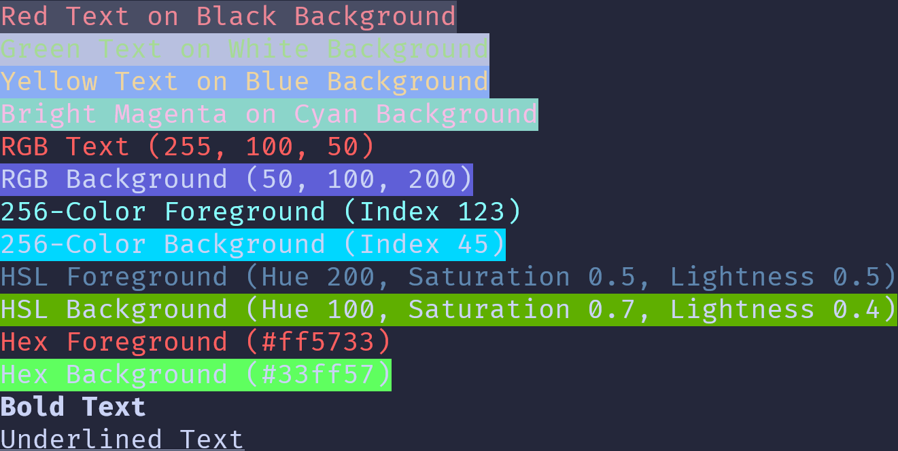

<h1 align="center">AnsiToolkit</h1>

<p align="center">

<a src="https://pypi.org/project/ansitoolkit/" target="_blank">

</a>
</p>

The `ansitoolkit` Python package was created to simplify working with ANSI escape codes, which are often essential for adding color, formatting, and cursor control in terminal applications. However, using ANSI codes directly can be cumbersome and error-prone, as they are not intuitive and can be difficult to remember or look up.

To address this challenge, we designed `ansitoolkit` with a modular approach, organizing ANSI escape codes into dedicated classes. This structure allows users to access the codes in a more readable and manageable way, such as through methods and attributes like `CursorMovement.move_up()` or `Color.RED`. By encapsulating the complexity of ANSI codes within these classes, `ansitoolkit` makes it easier for developers to create terminal-based applications without needing to constantly reference ANSI code charts or worry about syntax errors.

With `ansitoolkit`, our goal is to provide a developer-friendly interface that streamlines the use of ANSI codes, enabling more efficient and visually appealing terminal output.

## Installation

<!-- termynal -->
```
pip install ansitoolkit
---> 100%
```

## Example

```python
from ansitoolkit import (
    Ansi256Colors,
    Colors,
    Effects,
    HexColors,
    HSLColors,
    RGBColors,
)


def main():
    # Basic Colors
    print(f"{Colors.FG_RED}{Colors.BG_BLACK}Red Text on Black Background{Effects.RESET}")
    print(f"{Colors.FG_GREEN}{Colors.BG_WHITE}Green Text on White Background{Effects.RESET}")
    print(f"{Colors.FG_YELLOW}{Colors.BG_BLUE}Yellow Text on Blue Background{Effects.RESET}")

    # Bright Colors
    print(f"{Colors.FG_BRIGHT_MAGENTA}{Colors.BG_CYAN}Bright Magenta on Cyan Background{Effects.RESET}")

    # RGB Colors
    print(f"{RGBColors.rgb_foreground(255, 100, 50)}RGB Text (255, 100, 50){Effects.RESET}")
    print(f"{RGBColors.rgb_background(50, 100, 200)}RGB Background (50, 100, 200){Effects.RESET}")

    # 256-Color
    print(f"{Ansi256Colors.color_foreground(123)}256-Color Foreground (Index 123){Effects.RESET}")
    print(f"{Ansi256Colors.color_background(45)}256-Color Background (Index 45){Effects.RESET}")

    # HSL Colors
    print(f"{HSLColors.hsl_foreground(200, 0.5, 0.5)}HSL Foreground (Hue 200, Saturation 0.5, Lightness 0.5){Effects.RESET}")
    print(f"{HSLColors.hsl_background(100, 0.7, 0.4)}HSL Background (Hue 100, Saturation 0.7, Lightness 0.4){Effects.RESET}")

    # Hex Colors
    print(f"{HexColors.hex_foreground('#ff5733')}Hex Foreground (#ff5733){Effects.RESET}")
    print(f"{HexColors.hex_background('#33ff57')}Hex Background (#33ff57){Effects.RESET}")

    # Effects and Device Status
    print(f"{Effects.BOLD}Bold Text{Effects.RESET}")
    print(f"{Effects.UNDERLINE}Underlined Text{Effects.RESET}")


if __name__ == "__main__":
    main()
```

**Output**

